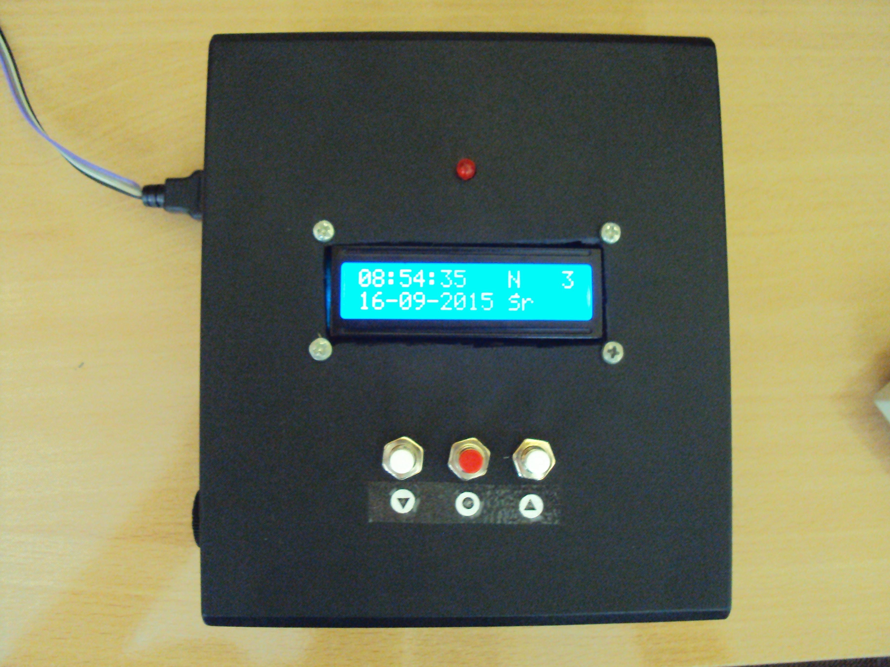

# Dzwonek II LO Kielce

Automatic school bell system for II Liceum Ogólnokształcące im. Jana Śniadeckiego in Kielce

AVR ATmega328P-PU microcontroller was used in this project. Schematic and PCB were made respectively in ExpressSCH and ExpressPCB.

## Features:

- Controlling school bell system by relay 6A/250VAC or 6A/28VDC
- Direct programming on device or by loading configuration from microSD card (included application to configure)
- Simple and intuitive interface in Polish
- Automatic time transition (summer / winter)
- 4 profiles (Normal, Shortened, Other 1, Other 2), in each ability to set 40 bells
- Setting the calendar for whole school year
- Diffrent duration of the bell for a break and lesson
- Synchronization with DCF77 pattern
- Backup battery for timing in case of power failure
- Maintenance-free, requires only setting the calendar on the begin of each school year.

[Instructions of use (PL)](https://szymonkatra.github.io/data/project/dzwonekiilokielce/doc/instrukcja_uzytkowa.html)  
[Technical documentation (PL)](https://szymonkatra.github.io/data/project/dzwonekiilokielce/doc/dokumentacja_techniczna.html)

**Project is available only for illustrative purposes or private usage.**  
**Commercial usage and redistribution without permission of the author is forbidden**

