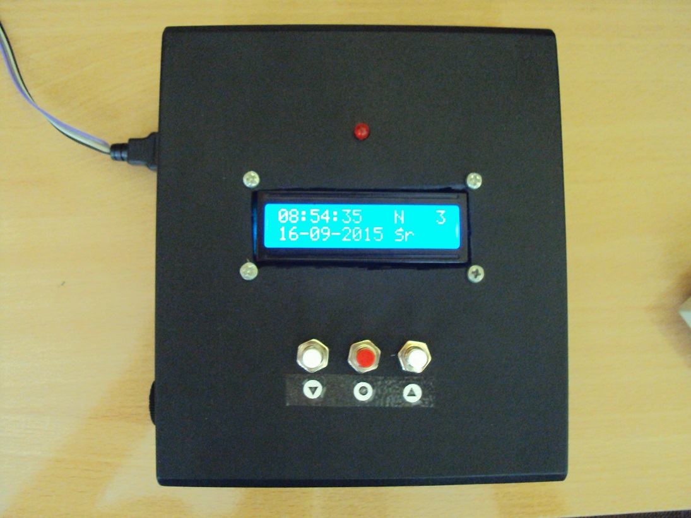

# Dzwonek II LO Kielce

Projekt dzwonka automatycznego II LO w Kielcach.

Więcej informacji: http://szymonkatra.github.io/project/dzwonekiilokielce/

Projekt jest udostępniony tylko i wyłącznie w celach poglądowych lub do użytku prywatnego.
Zakaz wykorzystywania w celach komercyjnych oraz rozpowszechniania bez zgody autora.

--------------------------------------------

Automatic school bell system for II Liceum Ogólnokształcące im. Jana Śniadeckiego in Kielce

More information: http://szymonkatra.github.io/en/project/dzwonekiilokielce/

Project is available only for illustrative purposes or for private usage.
Commercial usage and redistribution without permission of the author is forbidden

